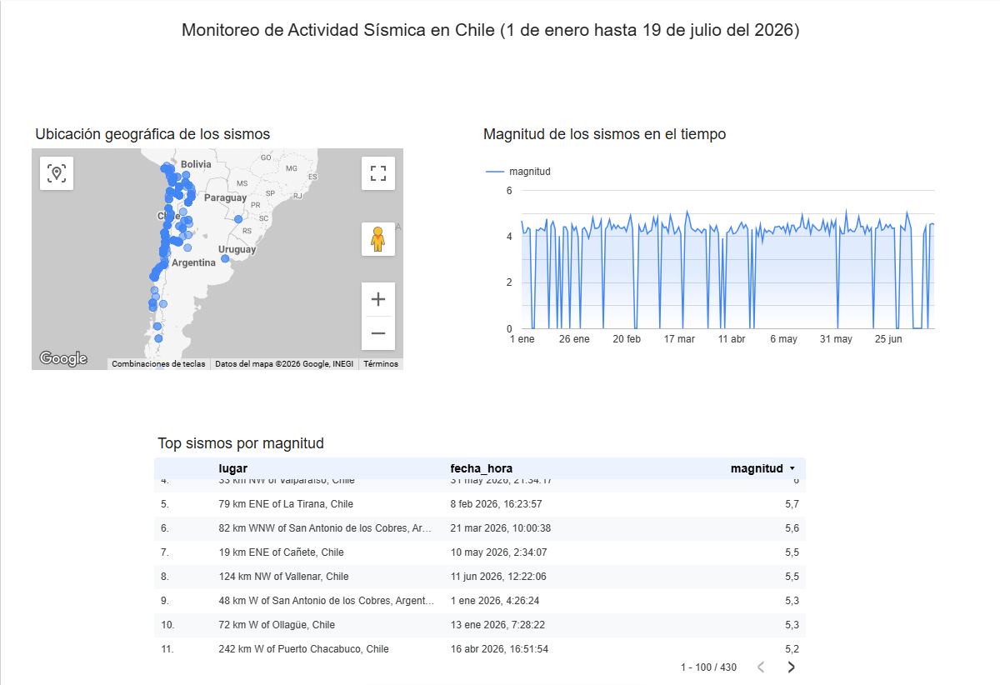

# Pipeline de Datos Sísmicos de Chile

Pipeline ETL end-to-end que extrae datos de actividad sísmica en Chile desde una API pública, los transforma y carga en un data warehouse en la nube, y los visualiza en un dashboard interactivo.

## Arquitectura

```
API pública (USGS) → Cloud Storage (datos crudos) → Python (transformación) → BigQuery (datos estructurados) → Data Studio (visualización)
```

## Herramientas utilizadas

- **Python**: extracción y transformación de datos
- **Google Cloud Storage**: almacenamiento de datos crudos (raw)
- **Google BigQuery**: data warehouse para datos estructurados
- **Data Studio** (anteriormente Looker Studio): visualización y dashboard
- **API de USGS** (U.S. Geological Survey): fuente de datos pública de sismicidad global

## Qué hace el pipeline

1. **Extracción** (`extraer_sismos.py`): consulta la API de USGS filtrando sismos dentro de un área geográfica que cubre Chile, y guarda la respuesta cruda en formato JSON en un bucket de Cloud Storage.
2. **Transformación y carga** (`transformar_cargar.py`): lee el JSON crudo, aplana la estructura anidada extrayendo los campos relevantes (fecha, magnitud, ubicación, profundidad), y carga los datos ya estructurados en una tabla de BigQuery.
3. **Visualización**: la tabla de BigQuery se conecta a Data Studio para construir un dashboard interactivo con mapa geográfico, serie temporal de magnitud, y ranking de los sismos más fuertes.

## Dashboard

[Ver dashboard en vivo](https://datastudio.google.com/reporting/b3910d0b-de4f-4b1c-ae04-c9eca6c21016)



## Estructura del repositorio

```
├── extraer_sismos.py         # Script de extracción (API → Cloud Storage)
├── transformar_cargar.py     # Script de transformación y carga (Cloud Storage → BigQuery)
└── README.md
```

## Notas técnicas

El filtro geográfico usa un bounding box rectangular de coordenadas, por lo que algunos sismos cercanos a la frontera con Argentina, Bolivia y Perú aparecen en los resultados. Una mejora futura sería filtrar por polígono exacto del país o filtrar el campo `lugar` por texto.

## Posibles mejoras futuras

- Automatizar la ejecución diaria con Cloud Scheduler + Cloud Functions
- Filtrado geográfico más preciso (polígono en vez de bounding box)
- Agregar tests unitarios para las funciones de transformación
- Particionar la tabla de BigQuery por fecha para optimizar costos de consulta

## Autor

Jorge Luis Rebaza Micha — [LinkedIn](https://linkedin.com/in/jorge-luis-rebaza/)
